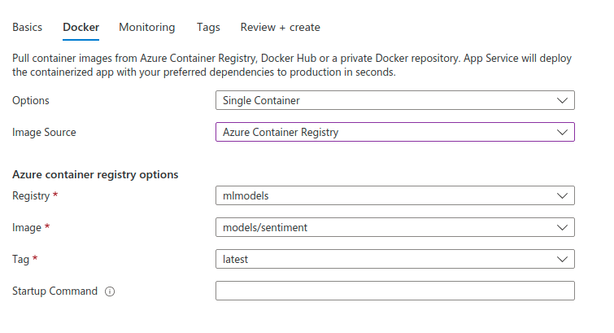
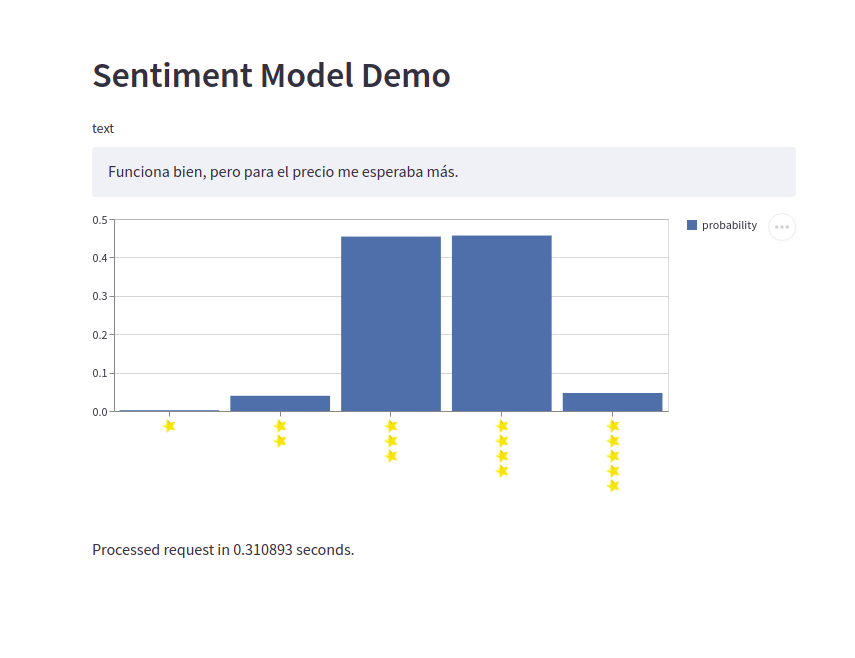

# AWS Model Deployment

Deploy a [Tensorflow Serving](https://www.tensorflow.org/tfx/guide/serving) model via [MS Azure App Service](https://azure.microsoft.com/en-us/services/app-service/).

# Install dependencies

(Run this from an environment such as conda.)

```console
pip install -r requirements.txt
```

# Train the model

Train a 5-star rating classifcation model on Amazon product reviews.

```console
python -m train_model
```

# Deploy in Azure

## Upload Image

This requires [azure-cli](https://docs.microsoft.com/en-us/cli/azure/install-azure-cli) and docker installed.
Under Linux you can install root-less docker as an unprivilidged user (
[blogpost](https://medium.com/@tonistiigi/experimenting-with-rootless-docker-416c9ad8c0d6)
).

### Create AZR

Create an Azure Container Registry (AZR).


### Login into ACR

```
az login
```

#### Option A

```
az acr login --name mlmodels
```

#### Option B

Enable admin user:


```
sudo docker login mlmodels.azurecr.io
```

### Build and Push Image

(docker commands might need sudo rights on Linux.)

**Important**: replace mlmodels with the name of your registry.

```
docker build -t sentiment .
docker tag sentiment mlmodels.azurecr.io/models/sentiment
docker push mlmodels.azurecr.io/models/sentiment
```

You should now see the image in ACR:


## Deploy App

Create an app:




Set the web service port in the app settings:


Now wait for the service to become available.
This can take up to 10 minutes.

Once it's up we can navigate to the instance and the page should show:

```
Sentiment Model Server
```

# Start Demo

Now we can start our demo server locally and make calls to the deployed model.

# Define a variable with our endpoint URL

**Impotant:** We will have to change the URL below to match our instance.

### Linux / bash

```bash
export ENDPOINT_URL="https://mysentimentmodel.azurewebsites.net"
```

### Windows

```bash
set ENDPOINT_URL="https://mysentimentmodel.azurewebsites.net"
```

## Start streamlit

```bash
streamlit run app.py
```



## Stop & Delete

Don't forget to stop and delte the service when you are done.