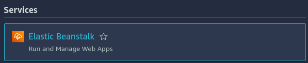
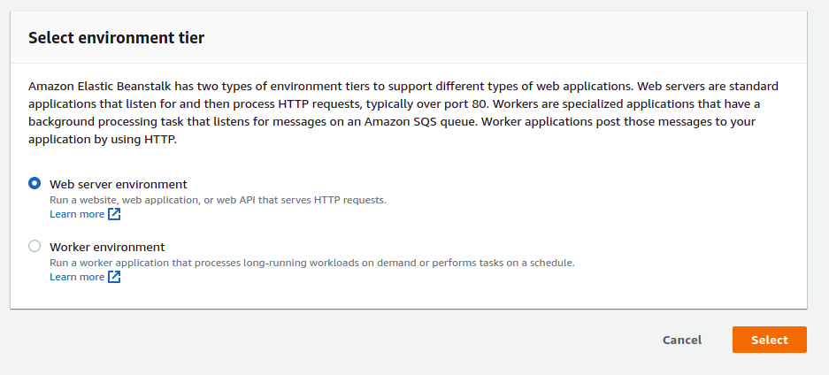
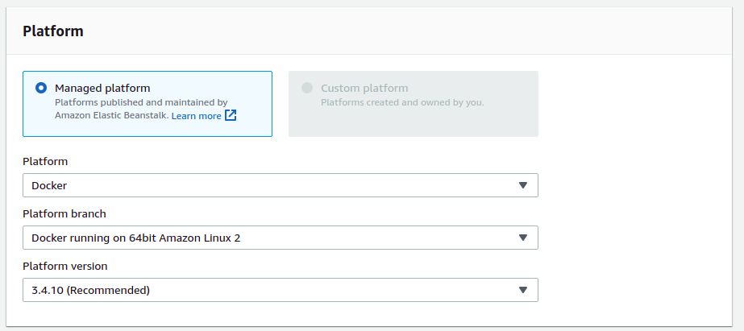
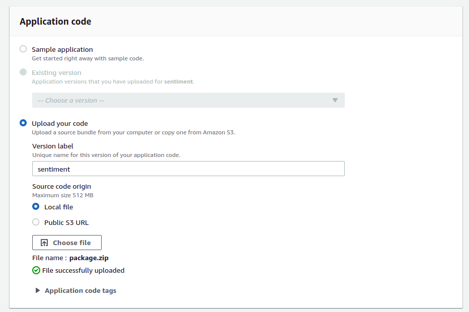
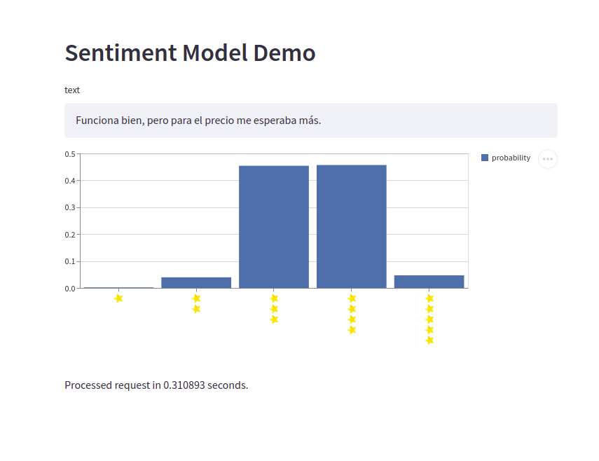

# aws_model

Deploy a model via AWS beanstalk

# Install dependencies

pip install -r requirements.txt

# Train the model

```console
python -m train_model
```

# Create package

```console
python -m create_package
```

# Deploy in AWS

First we create a new environment in AWS beanstalk.









Now wait for the environment to become available.

# Start Demo

```console
export ENDPOINT_URL="http://sentiment-env.eba-hviumu6m.eu-central-1.elasticbeanstalk.com"
streamlit run app.py
```


